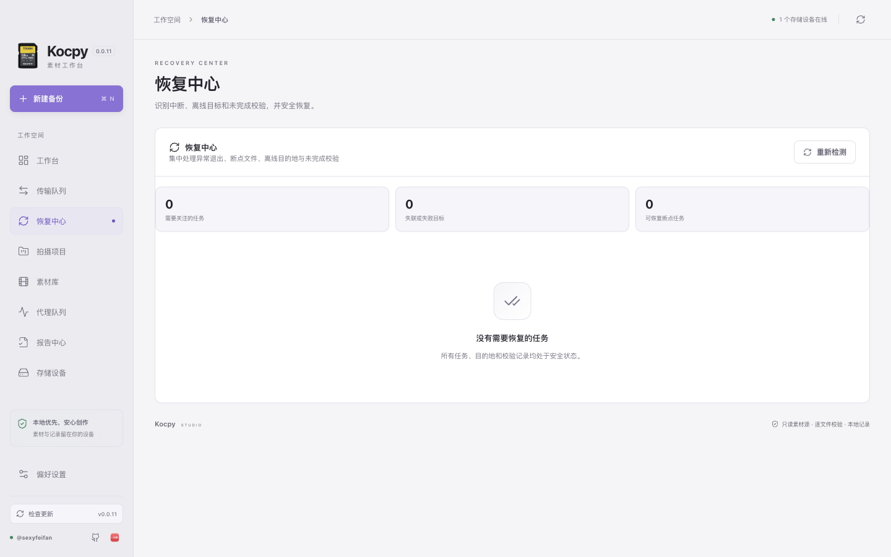
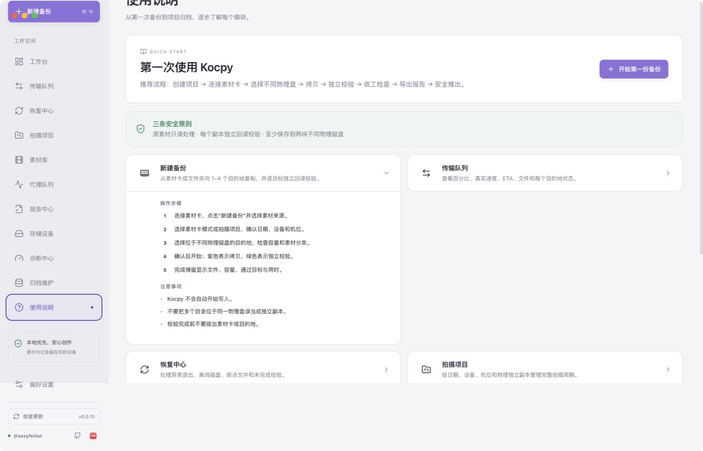
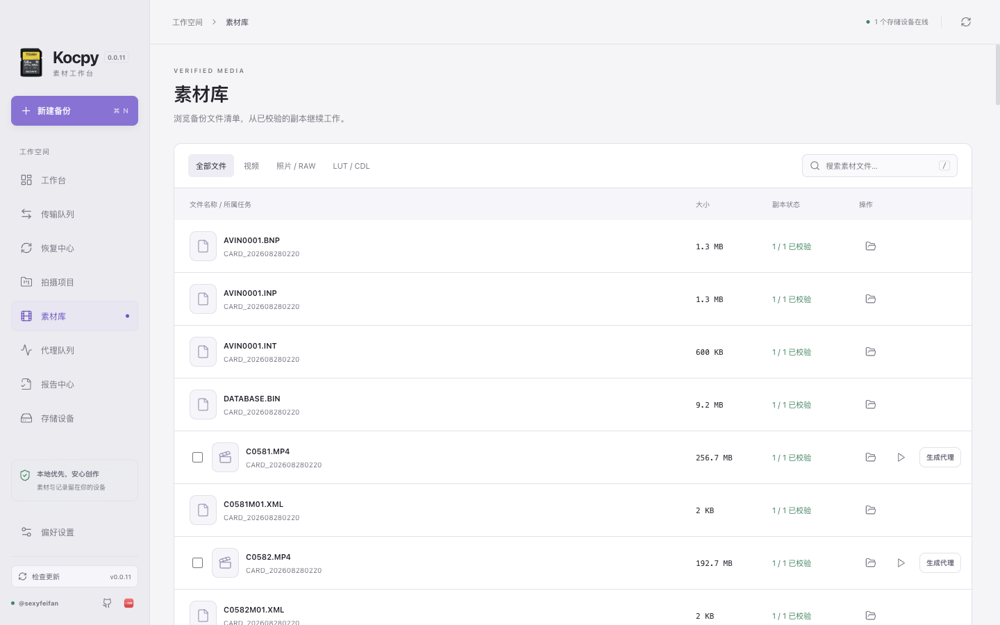
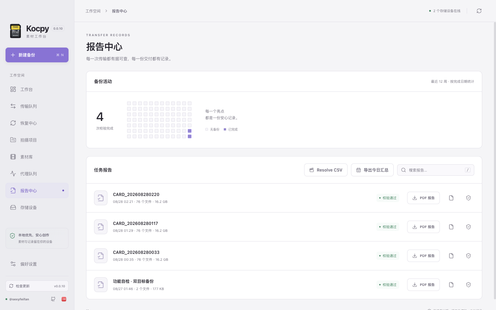

# Kocpy

<p align="center"></p>

<p align="center"><strong>面向片场与工作室的 macOS 素材备份与项目归档工作台。</strong><br>本地优先 · 多目的地安全拷贝 · 独立回读校验 · 项目全周期记录</p>

<p align="center"><a href="#中文">中文</a> · <a href="#english">English</a> · <a href="#日本語">日本語</a></p>


当前代码版本：**0.1.29** · [完整使用手册](docs/USER_GUIDE.md) · [0.1.29 更新说明](docs/RELEASE_NOTES_0.1.29.md) · [已公开发布版本](https://github.com/sexyfeifan/Kocpy/releases/latest)

0.1.29 把长期归档健康、复校验运行、位置变化和提醒纳入同一个带 SHA-256 摘要的权威工作区提交。每次复校验记录操作人、范围、基线摘要、逐素材卷结果、离线／身份未知状态和真实读取量；提醒只负责通知，不会冒充已执行校验。归档修复重新哈希健康来源、确认目标磁盘身份、保留损坏原件，并在原子发布后完整回读。已公开安装包以 Release 实际附件为准，草稿不是公开发行；验证边界及已知限制见 [验证记录](docs/VERIFICATION.md)。

## 中文

### 一套完整的素材工作流

Kocpy 将素材卡接收、多目标备份、逐目标回读校验、项目归档、媒体预览、代理生成和交付报告放在一个本地工作空间中。素材源按只读原则处理，文件先写入任务专属断点文件，同步完成后再发布为最终文件；每份副本随后独立回读并与源哈希比对。

普通备份无需创建项目，适合快速接收一个或多个来源，提供“按次保存”和“保留源文件夹（镜像备份）”。项目模式绑定拍摄项目，保存拍摄周期、设备、机位、素材卷前缀与备份根目录，并采用：

```text
备份根目录 / 项目开始日期_项目名 / 拍摄日期 / 设备 / [同型号机位] / 设备_任务开始时间 /
```

例如：`20260827_山海之间/20260829/FX3/A/FX3_202608291430/`。机位名称可自定义；未启用同型号多机位时不会产生机位层级。


### 安全备份与真实状态

- 同时写入 1–4 个目的地，一次读取素材数据块并分发给多个目标。
- 支持 SHA-256、SHA-1 与 MD5；拷贝结束后逐目标独立回读校验。
- 支持暂停、继续、取消、异常恢复、大文件断点续传、失败目标单独重试与完成后复校验。
- 恢复中心集中列出异常退出、暂停任务、离线目标和未完成校验，并区分“当前位置继续”“扫描并复用断点”“仅重试失败目标”和“重新校验全部副本”。成功目标不会在单目标重试中重新读取或初始化。
- 失败任务可进入“检查并恢复”：按身份、离线、权限、空间或校验错误提供下一步，先只读比较记录身份和当前挂载卷，再由用户确认重试。查询失败与真实换盘分别提示；不会自动覆盖旧 UUID。
- 记录卷 UUID，防止同名磁盘替换后误写；按物理卷合并预检空间和临时发布余量。
- 慢盘可以从快速分发中分离，健康目标继续完成。
- 选择素材源后扫描本次实际待备份容量、文件数量，并显示磁盘总容量和可用空间；不再自动遍历所有未选择的介质。
- 设置目的地时可直接点击外接磁盘，并从该磁盘继续选择目标文件夹。
- 紫色进度表示拷贝，绿色覆盖表示校验；显示真实有效传输速度、回读速度、百分比与时分秒剩余时间。
- 速度按操作系统确认完成的字节以 1 秒间隔采样和平滑处理；多目标速度不会重复累加。
- 任务详情分别显示源素材哈希读取、源素材分发读取、各目标写入和校验回读曲线；完整任务记录保留平均值、P50、P95、峰值与停顿次数，并指出持续最慢的目的地。
- 校验结束后结算任务并显示不抢焦点的完成提示，媒体缩略图随后在后台生成。




### 项目全周期看板

项目页按“拍摄日期 × 设备/机位”展示素材卷、文件、容量和副本状态。可设置 1–4 份收工标准；休息／未使用只解释空白单元，不掩盖已有素材的风险。同盘目录或分区不重复计算；不同 UUID 本身也不证明物理独立。校验后依据同次系统存储拓扑保守计数，旧记录或未知阵列／网络关系不自动增加第二份。连接原目标重新校验可更新证据，原哈希记录仍保留。

既有备份可按单张素材卡、单日所有机位或整个项目接管。Kocpy 会复用项目命名规则识别日期、设备、项目机位和任意名称的素材卷；接管任务与原生任务共同进入项目矩阵，缺少历史机位元数据的旧任务会明确显示为“未标机位”。

接管读取过程显示素材卷、文件、字节、速度、剩余时间和当前文件。目录识别、外部清单校验、首次基线与清单不匹配使用不同状态；项目外设备只在实际发现的拍摄日显示，没有文件夹的设备先标为“待确认”，不会直接推断成漏备份或当天未使用。

0.1.24 的接管预览会逐卷显示并允许修正日期、设备、机位和卷名。预览保存当前目录清单摘要；开始接管和全部读取完成后都会再次扫描，目录内容或识别映射变化时整批停止且不写入记录。用户须确认相同完整哈希的不同路径属于同一逻辑素材卷；位于同一物理盘的多个目录仍只计一份。素材库的重定位在原副本离线时更新位置，全部旧副本仍在线时则可关联另一份经过完整哈希核对的健康副本。

同一个素材卷路径重复接管时只保留一条逻辑记录。0.1.8 的“刷新接管信息”还会识别并移除旧版本误生成的日期/设备父级汇总记录，只保留下层真实卡卷；同时读取卡卷根目录的 MHL/SHA 清单元数据，明确显示缺少、额外和大小不同的文件。Kocard MHL 的十进制 xxHash32 已可用于完整清单接管校验。

刷新只处理已经接管到 Kocpy 的外部记录：不会重新哈希、移动、删除或重新复制素材，不会修改 Kocpy 原生备份任务，也不会自动发现后来新加入且从未接管的文件夹。来源暂时离线时原记录会保留；重新连接后可再次刷新。关于接管可信度、目录识别、收工状态和旧项目修正，请参阅[完整使用手册](docs/USER_GUIDE.md#5-018刷新接管信息)。

0.1.10 将素材卷明细中的清单差异改为可点击的处理入口：可以查看全部差异路径并在 Finder 中定位；缺失文件可从用户选择的同卷健康副本补回，写入前后均按原清单校验，随后自动整卷重校验；单纯的额外文件可在已有完整哈希基线后由用户明确确认。原 MHL 不会被修改，差异与处理决定会保留在审计记录中。

0.1.11 修复健康副本经过目录重组后无法补回的问题。用户可选择素材卡根目录、对应素材子目录或其上级目录；Kocpy 只在找到唯一且完整的清单路径映射时继续，并在写入前校验全部源文件与剩余空间。文件会先在目标卷统一暂存并回读校验，再安全提交；歧义、内容不符或中途失败均不会留下半套修复结果。

0.1.12 增加“操作人有意剔除素材”的经审计 MHL 修订流程。仅有纯缺失差异时，用户填写原因、勾选风险确认并输入指定文字后，Kocpy 才允许从生效 MHL 排除这些记录。原始清单会先按 SHA-256 备份到素材卷内隐藏的审计目录，并随素材卷迁移；修订清单自检和整卷重校验通过后，素材卷明确显示排除数量，并可随时定位原始 MHL。素材文件不会被删除，大小或哈希异常不能借此跳过。

0.1.13 优化“缺失 + 额外”混合清单差异：弹窗明确给出先补回、再核对、最后处理额外文件的顺序；修复成功后即使仍有差异，也会保留修复结果并原地刷新，不再显示成远程调用错误。带 `(1)` 的缺失路径与相似额外路径会作为疑似同名冲突列出双方大小，0 字节额外文件会单独警告。有效额外文件可直接在同一弹窗建立完整当前哈希基线后确认，无需退出重进。

0.1.14 是一次安全加固版本：任务完成前重新扫描素材源并持续核对卷身份，修复慢速目标分发偏移，最终文件与任务数据库执行落盘同步和原子发布；数据库/JSON 双记录按最新检查点合并，冷归档写后重读，安全推出重新核对素材卡。MHL 改为记录已校验副本的真实最终路径，未解决清单差异或副本不足时拒绝生成可信归档；诊断包进一步哈希化任务名、卷名和标签。

0.1.15 让传输任务更容易辨认和追踪：视频、照片/RAW、音频、混合素材与其他素材卷使用不同图标，图标颜色继续表达任务状态；每条任务完整列出源路径和所有目的地的实际最终路径，并可直接在 Finder 中定位。已归档项目新增受保护的内部记录删除入口，便于重新执行完整测试；它只清理 Kocpy 的项目、任务、代理和归档维护记录，不删除素材、备份目录、报告、MHL 或已导出的归档文件。

0.1.16 将受保护的内部记录删除扩展到进行中项目，无需为了重做测试而先归档；删除前会显示准确范围，要求勾选风险确认并输入完整项目名称，任何活动备份或代理任务都会阻止删除。项目模板升级为可解释、可新建、重命名、编辑、导入导出和选择性应用的制作流程；五个系统模板会直接说明其设备、副本、检查表和完成动作差异。低高度窗口中的侧栏不再压缩文字和图标，中间导航改为独立滚动。

项目完成后可导出：

- 项目完整 PDF：项目总览、日期与设备矩阵、全部素材卷、目的地、校验结论和完整文件明细。
- 项目完整 JSON：项目配置与所有任务、目标、文件、哈希和校验记录，便于长期归档或二次处理。
- 项目 CSV：按日期、设备、机位和素材卷整理的表格数据。
- 项目归档包：一次导出项目 PDF、完整 JSON、统计 CSV、每个素材卷的 MHL 清单和用于验证整个归档包的 `SHA256SUMS.txt`。
- 单任务 PDF / JSON / MHL / ASC MHL。
- 拍摄日汇总 PDF 与 Resolve 媒体池 CSV。


### 素材、代理与报告

- 素材库展示已校验副本、首帧缩略图、摄影机型号、拍摄时间、分辨率、帧率、时长、编码与时间码。
- 扫描来源时按视频、照片 / RAW、音频和其他文件分类显示数量与容量。
- 可批量生成 H.264 或 ProRes Proxy，支持进度、取消、重试和定位输出。
- 提供通用审片、剪辑代理和离线剪辑预设，支持自定义输出命名规则、暂停/继续，并保留原始任务与相对路径关联。
- 自定义代理预设可保存、更新和删除；代理任务支持显式依赖链，项目可在备份完成后自动加入代理队列。
- 代理完成后检查帧率、时间码和音轨，并可导出 Resolve CSV、Premiere CSV、Final Cut XML 或完整 JSON 交付清单。
- 归档维护中心支持项目级长期复校验、健康历史、从健康副本修复失败副本，并保留原损坏文件以供检查。
- 长期复校验覆盖整盘、项目、拍摄日、素材卷和单文件，记录操作人、运行摘要、逐素材卷结论、真实读取吞吐、风险等级、离线／身份未知目标、未登记新增文件、位置迁移与变化时间线。
- 周期提醒依据最近一次成功复校验计算；发送系统通知不会推进校验日期。归档证据与任务状态在同一权威工作区修订中提交，变化记录形成摘要链，项目证据报告包含可复算 SHA-256。
- 项目模板可自定义名称、说明、设备/机位、每台设备的素材卷前缀、副本标准、预计卷数、命名规则、完成动作、开工/收工检查表和制作人员；应用前可逐项预览并选择覆盖范围，自定义模板支持导入导出。
- 插入历史素材卡时会建议项目、设备和下一卷号；发现相同文件结构与容量时会明确提示重复接收风险，且不会自动开始写入。
- 支持完整本地数据备份，以及多台 Kocpy 工作站之间的项目、任务、模板与健康记录合并；内容指纹用于跳过重复素材并报告命名冲突。
- 大型素材库按批次加载，诊断、事件和健康历史均设有体积上限，避免长期项目拖慢界面与记录写入。
- SQLite/WASM 索引保存完整任务与文件记录，支持增量更新、分页、轮换备份、损坏恢复、项目冷归档，并通过十万与百万文件压力测试。
- PDF 报告使用与应用一致的版式，并在素材条目中嵌入可用缩略图。
- 报告与清单可镜像到用户指定的同步文件夹；素材文件不会被上传。
- 本地快照、隐藏挂载目录与系统备份卷不会被识别为可选存储设备。
- 存储设备页可批量安全推出所有已完成设备；仍被备份或代理任务使用、存在未被后续成功任务覆盖的失败记录时，磁盘会被保留并说明原因。
- 诊断中心可对选定磁盘执行受控的 64 MiB 写入与回读性能预检，自动清理临时文件，并导出不含素材内容、完整私人路径或账号信息的脱敏诊断包。
- 任务记录保留最近的暂停、继续、预检异常和完成事件，帮助判断素材源失联、目的地离线、断点可恢复及副本未校验等状态。
- 软件内“使用说明”按模块提供操作步骤、注意事项与直达入口，覆盖从第一次备份到长期归档的完整工作流；模块默认全部折叠，仅在用户点击后展开。








### 外观、隐私与更新

Kocpy 支持真实深色与浅色外观，任务、项目、偏好、缩略图和代理记录保存在 `~/Library/Application Support/Kocpy/`。软件无需账号，不上传素材。应用会根据当前显示器可用区域选择默认窗口尺寸；在 1080 × 720 最小窗口中，内容页、表格和弹窗使用各自的安全滚动区域。侧栏始终保持正常文字、图标和品牌比例，高度不足时仅中间导航区域滚动。功能按“工作台 → 项目 → 接收与恢复 → 素材管理与交付 → 存储与维护 → 诊断与说明”排列。左下角可检查 GitHub Release 更新，并提供作者 [@sexyfeifan](https://github.com/sexyfeifan) 的 GitHub 与[小红书](https://www.xiaohongshu.com/user/profile/5d24d2ca000000001103fe97)入口。


### 安装

从 [GitHub Releases](https://github.com/sexyfeifan/Kocpy/releases) 下载对应架构：

- `Kocpy-0.1.29-arm64.dmg`：Apple Silicon Mac
- `Kocpy-0.1.29-x64.dmg`：Intel Mac

当前代码对应上述版本；远端可下载版本以 Release 实际附件为准。

打开 DMG，将 Kocpy 拖入“应用程序”。当前公开包尚未使用 Apple Developer ID 签名和公证。若 macOS 明确提示应用“已损坏”，请先确认文件来自本仓库官方 Release，再执行：

```bash
xattr -dr com.apple.quarantine "/Applications/Kocpy.app"
```

不要全局关闭 Gatekeeper。

## English

Kocpy is a local-first macOS workspace for verified media offload and production archiving. It copies one source to up to four destinations, reads every copy back for checksum verification, resumes interrupted large files, tracks physical volumes, and produces task, shooting-day, and full-project reports. Its Recovery Center can retry only failed destinations while preserving successful copies and their verification records.

Project mode organizes media by project, date, camera, optional camera position, and card volume. Closeout distinguishes verified targets from independent-copy evidence: different UUIDs alone do not prove different disks. Only contemporaneous known storage topology adds independent copies; unknown relationships are conservative. Rest/unused exceptions apply only to empty cells, never recorded media risks. Records export as PDF, JSON, CSV, or an archive with MHL and SHA-256 checksums.

Kocpy also includes media thumbnails and metadata, H.264/ProRes proxy queues, Resolve CSV export, light/dark appearance, update checks, and architecture-specific DMGs for Apple Silicon and Intel Macs. An in-app guide documents every module with steps, safety notes, and direct links. Media and records stay on the Mac unless the user explicitly selects a report mirror folder.

Version 0.1.12 adds an audited MHL revision workflow for media intentionally withheld due to privacy, rights, or delivery scope. It is available only for pure missing-file differences and requires a reason, a risk acknowledgement, and typed confirmation. Kocpy preserves the original MHL with its SHA-256 in local audit history, validates the revised manifest, fully reverifies the retained media set, and labels the result with the exclusion count. It never deletes media, and size or checksum mismatches cannot be waived.

Version 0.1.13 makes mixed manifest differences actionable in place. Missing files are repaired first, successful repairs remain committed when unrelated extras still need review, likely numbered-name collisions show both expected and actual sizes, and zero-byte extras receive a dedicated warning. A complete current hash baseline can be established from the same dialog before intentionally accepting valid extra files.

Version 0.1.14 hardens completion, persistence, and recovery. Kocpy rescans the source before success, continuously verifies volume identity, fixes slow-destination write offsets, fsyncs published media and records, reconciles its JSON mirror with the indexed catalog, verifies cold archives after writing, and rechecks source inventory before safe eject. MHL exports now use the verified destination's actual paths, while unresolved manifest differences and insufficient physical copies cannot be packaged as a trusted archive.

Version 0.1.15 adds media-aware task icons, full source and final-destination paths with Finder reveal, and a guarded reset for archived projects. Project reset removes only Kocpy's internal project, task, proxy, and archive-maintenance records; it never deletes media, backup folders, reports, MHL manifests, or exported archives.

Version 0.1.16 extends guarded internal-record deletion to active projects, while blocking deletion whenever backup or proxy work is unfinished and requiring both an acknowledgement and exact project-name confirmation. Project templates are now described, editable, importable/exportable, and selectively applied after a field-by-field preview. The sidebar keeps stable text and icon proportions at reduced window heights and scrolls only its navigation area.

## 日本語

Kocpy は、macOS 向けのローカル優先メディアバックアップ／プロジェクト管理アプリです。1つの素材ソースを最大4つの保存先へコピーし、各コピーを独立して読み戻してチェックサム検証します。大容量ファイルの再開、物理ボリューム識別、容量事前確認に加え、成功済みコピーを保持したまま失敗した保存先だけを再試行できます。

プロジェクト、撮影日、カメラ、任意のカメラ位置、素材巻で整理します。UUID が異なるだけでは物理的独立性を認定せず、同時に確認したストレージ構成に基づき保守的に数えます。不明な関係は独立コピーを増やさず、休止指定も既存素材のリスクを隠しません。PDF／JSON／CSV、MHL と SHA-256 を含むアーカイブを書き出せます。

素材サムネイルとメタデータ、H.264／ProRes プロキシキュー、Resolve CSV、ライト／ダーク表示、更新確認、Apple Silicon／Intel 用 DMG も備えています。アプリ内ガイドでは、各機能の手順、注意事項、画面への直接リンクを確認できます。素材と記録は、ユーザーが明示的にレポート同期先を選ばない限り Mac 内に保持されます。

バージョン 0.1.12 では、プライバシー、権利、納品範囲の理由で意図的に除外した素材について、監査可能な MHL 改訂フローを追加しました。純粋な不足差異の場合のみ利用でき、理由、リスク確認、指定文字の入力が必要です。元の MHL と SHA-256 は監査履歴に保存され、改訂後のマニフェストを自己検証してから保持素材全体を再検証します。素材ファイルは削除せず、サイズやハッシュの異常を免除することはできません。

バージョン 0.1.13 では、不足と余分なファイルが同時にあるマニフェスト差異を段階的に処理できます。不足ファイルの修復成功は保持され、残る差異は同じ画面で更新されます。番号付き同名候補は双方のサイズを表示し、0 バイトの余分なファイルは個別に警告します。有効な余分ファイルを保持する場合は、同じ画面で現在の完全なハッシュ基準を作成できます。

バージョン 0.1.14 では、完了判定、永続化、復旧を強化しました。完了前の素材ソース再走査、ボリューム識別の継続確認、低速保存先の書き込み位置修正、ファイルと記録の fsync、JSON と索引の最新チェックポイント統合、冷却アーカイブの書き込み後検証、安全取り出し前の再確認を行います。MHL は検証済み保存先の実際のパスを記録し、未解決差異やコピー不足を信頼済みアーカイブとして出力しません。

バージョン 0.1.15 では、素材種別ごとのタスクアイコン、Finder で表示できる完全なソース／最終保存先パス、そしてアーカイブ済みプロジェクトの保護されたリセット機能を追加しました。リセットは Kocpy 内部のプロジェクト、タスク、プロキシ、アーカイブ保守記録だけを削除し、素材、バックアップフォルダ、レポート、MHL、書き出し済みアーカイブには触れません。

バージョン 0.1.16 では、保護された内部記録の削除を進行中プロジェクトにも拡張しました。未完了のバックアップまたはプロキシ作業がある場合は拒否され、確認チェックと正確なプロジェクト名入力が必要です。プロジェクトテンプレートは説明表示、編集、読み込み／書き出し、項目別プレビュー後の選択適用に対応しました。低いウインドウでもサイドバーの文字とアイコン比率を維持し、ナビゲーション部分だけをスクロールします。

0.1.18 improves folder layout previews, restores native folder drag-and-drop, keeps transfer details live, and hashes fresh files during copying while retaining independent destination readback. New mirror tasks retain the selected source folder; legacy tasks keep their original destination layout. See [release notes](docs/RELEASE_NOTES_0.1.18.md).

## License

Kocpy source code is available under the MIT License. The separately invoked FFmpeg 9.0.1/x264 runtime is GPL-2.0-or-later. Complete notices, pinned corresponding source archives and build scripts are bundled under the app's `Contents/Resources/ffmpeg` directory and provided alongside installers in each new Release. See [media notices](resources/ffmpeg/NOTICE.md). This does not claim App Store approval or patent clearance.

0.1.18 adds explicit maintenance scopes, retry-safe batch submission, shared path previews, editable camera positions, item-by-item checklists, background operation history, paginated media browsing, scoped exports, and NAS/LAN controls. Desktop acceptance limits are documented; independent destination verification remains mandatory.
