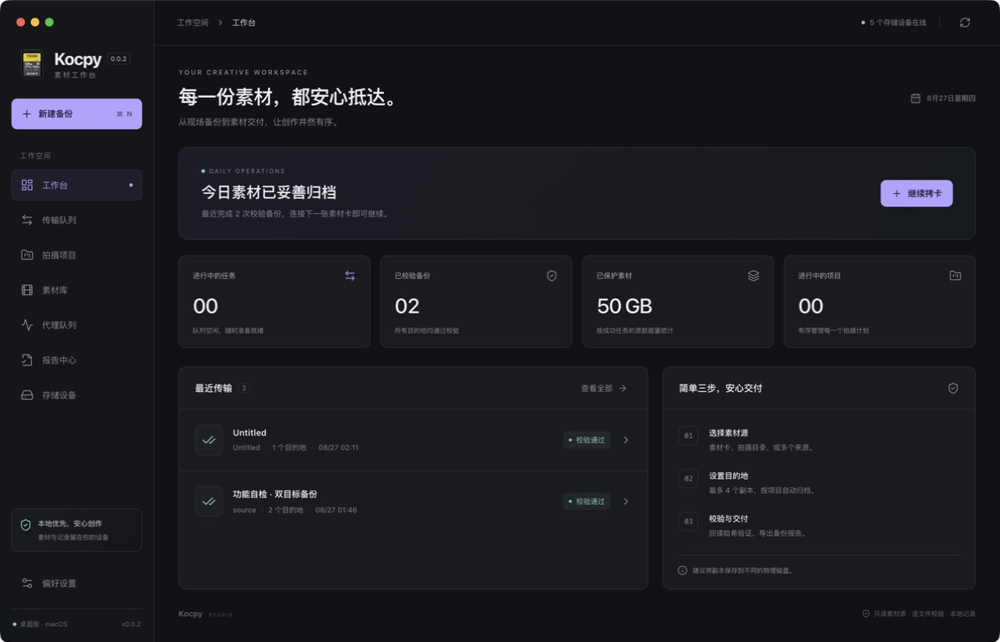
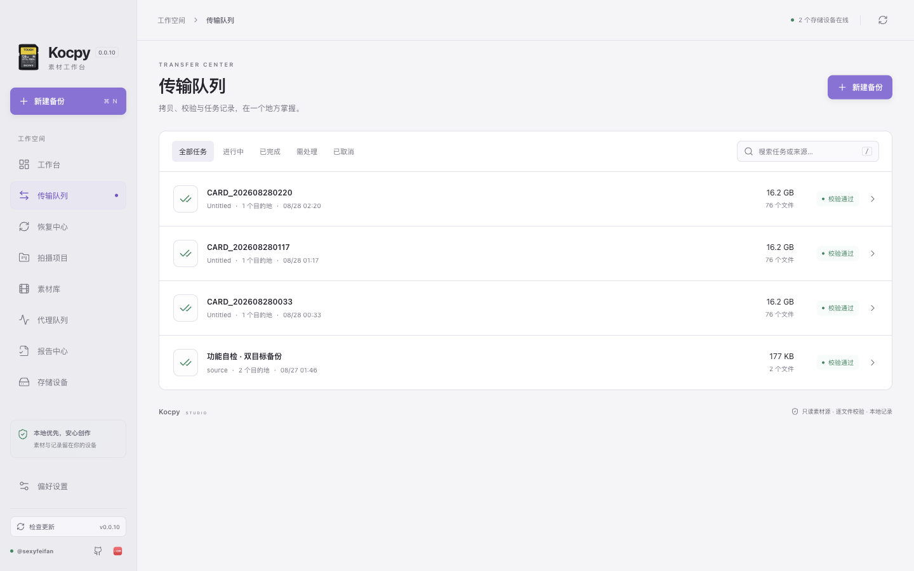
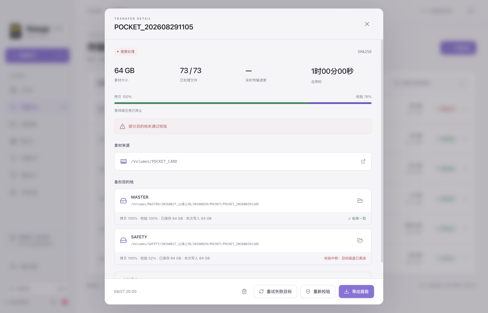
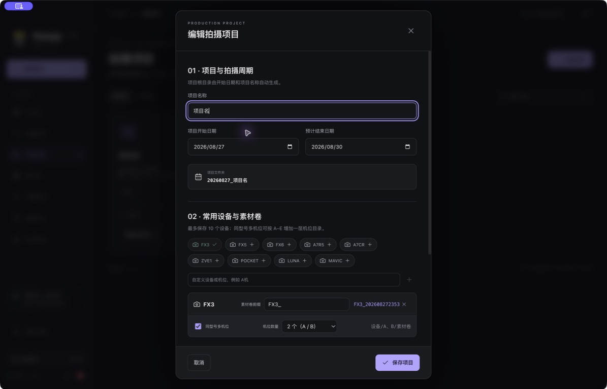
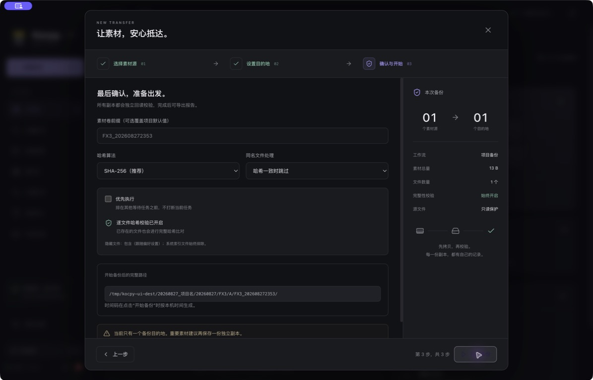
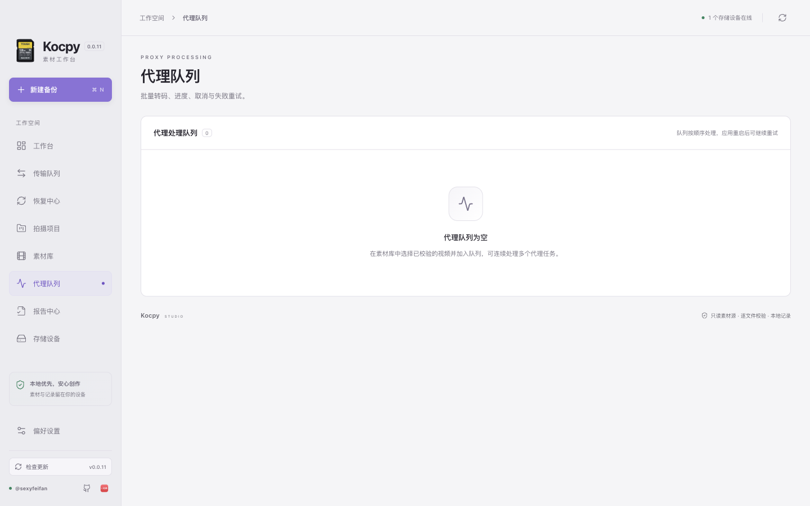
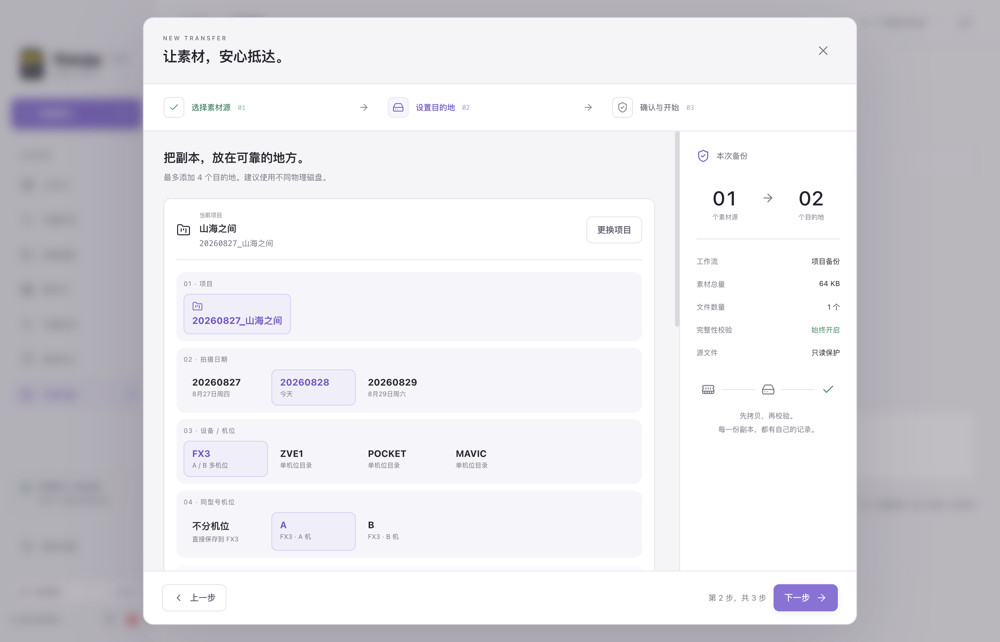
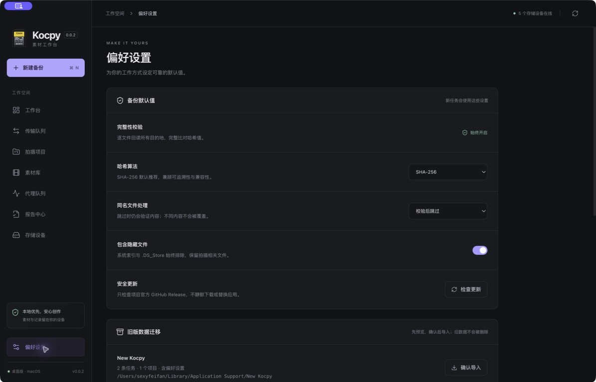

# Kocpy

<p align="center"></p>

<p align="center"><strong>面向片场与工作室的 macOS 素材备份工作台。</strong><br>多目的地安全拷贝、独立回读校验、项目归档、媒体预览、代理队列与交付报告，全部在本机完成。</p>



## 核心工作流

Kocpy 将素材接收、双备份、完整性校验、报告交付和代理生成放在同一个项目流程中。来源始终按只读思路处理，文件先写入任务专属的断点文件，完成同步后再发布为最终文件；每个目的地随后独立回读并与源哈希比对。

首页会根据任务状态显示当前传输、失败目标和待处理事项。新建备份分为素材卡备份和项目备份：素材卡备份适合临时接收一个或多个来源；项目备份绑定“拍摄项目”，复用拍摄周期、设备、素材卷前缀和备份根目录。

项目目录采用固定层级：`项目开始日期_项目名 / 当天拍摄日期 / 设备 / 素材卷`。例如 `20260827_山海之间/20260829/FX3/FX3_202608291430/`。同型号多机位启用后会增加 A–E 机位层级，例如 `20260827_山海之间/20260829/FX3/A/FX3_202608291430/`；未启用时不会产生空的机位目录。素材卷保留每台设备的自定义前缀，并在真正开始任务时追加本地年月日时分；同一分钟内重复接卡会添加安全序号，避免目录冲突。

## 安全备份

- 同时备份到 1–4 个目的地，每个素材源建立安全隔离的素材卷目录。
- 一次读取数据块并向多个目标分发，降低多副本任务对素材卡的重复读取压力。
- 慢盘可从快速扇出中分离，健康目标继续完成，避免单个目标长期阻塞整项任务。
- 支持 SHA-256、SHA-1 和 MD5；拷贝结束后逐目标独立回读校验。
- 支持暂停、继续、取消、异常恢复、大文件断点续传、失败目标单独重试及完成后的独立复校验。
- 任务检查点持续保存；断点恢复前会比较源文件与临时文件前缀，损坏的断点不会被继续使用。
- 通过卷 UUID 记录素材源与目标磁盘身份，重接后若同名挂载点对应了其他磁盘，会阻止读写。
- 按实际物理卷合并计算空间需求，包含断点占用和最终发布余量；多个目的地位于同一块盘时会给出风险提示。
- 单个目的地预检、写入或校验失败时，其他健康目的地可以继续完成。
- 同名文件先校验内容：一致则安全复用，不一致时保留原文件或创建带序号副本。



## 清晰的实时状态

传输详情以紫色显示拷贝进度，以绿色覆盖显示独立校验进度，同时展示百分比、当前文件、真实物理写入速度和“时/分/秒”格式的预计剩余时间。每个目的地分别显示拷贝进度、校验进度、实际写入量、速度与错误原因。

速度来自已完成的文件写入字节，并用短时间滑动窗口平滑。任务百分比按源数据逻辑字节计算，多个目标不会让百分比重复累加；物理写入量则反映所有目标实际写入的总量。

完成页会给出通过校验的目标数量，并提供打开报告、在 Finder 中定位副本和安全推出外置卷等操作。
任务完成后同时显示 macOS 通知和应用内完成弹窗，汇总文件数、素材大小、通过校验的目标数量与总用时。



## 项目与素材库

- 项目保存名称、拍摄周期、最多 10 个常用设备、各设备素材卷前缀和目标根目录。内置 FX3、FX5、FX6、A7R5、A7CR、ZVE1、POCKET、LUNA、MAVIC 候选，也可自定义设备名称。
- 每台设备可启用 2–5 个同型号机位，使用 A、B、C、D、E 管理；开始项目备份时可以确认或切换本次使用的机位。
- 保存项目时会立即在每个备份根目录下创建“项目文件夹 / 项目开始日期”基础结构，后续拍摄日与素材卷目录在任务开始时按需创建。
- 新建备份时可直接选择已有项目，也可在流程内首次创建项目；“拍摄项目”页面与备份向导使用同一份项目配置。
- 素材库集中展示已校验副本，保留原始目录结构和对应任务信息。
- 视频可查看缩略图、摄影机型号、拍摄时间、分辨率、帧率、时长、音视频编码与时间码。
- 备份校验完成后自动从已校验副本生成媒体缩略图；PDF 文件清单会在对应素材条目中嵌入缩略图，旧任务在导出报告时也会按需补充。
- 素材库可单独筛选并定位 CUBE、CDL、CC、CCC 与 CLF 调色文件。
- 可批量加入 H.264 或 ProRes Proxy 队列，查看逐项进度，并取消、重试或定位输出文件。
- 代理队列保存在本机，应用异常结束后会保留任务并提供重试。
- 可导出 DaVinci Resolve 媒体池 CSV，包含已校验媒体路径、卷名、机位、拍摄日与任务信息。







## 报告与交付

- PDF 任务报告采用与应用一致的视觉样式，汇总来源、目标、文件数量、容量、哈希与逐目标校验结果。
- 拍摄日汇总报告按项目归纳当天所有素材卷与目标结论。
- JSON 导出保留完整任务记录。
- MHL 1.1 清单便于通用交换。
- ASC MHL v2 清单使用 MD5、传输动作与哈希时间字段，输出通过仓库内官方 XSD 的结构校验。
- 可将导出的报告和清单镜像到用户选择的 iCloud Drive、Dropbox 或其他同步盘目录，素材文件不会被复制到该目录。

## 数据迁移、隐私与更新

设置页可预览并导入旧版 `New Kocpy` 与 `KocardPro` 的任务、项目和偏好。导入前会备份当前数据，旧目录不会被删除或改写。

Kocpy 不要求账号，不上传素材。任务、项目、设置、代理队列和缩略图保存在：

```text
~/Library/Application Support/Kocpy/
```

应用启动后自动检查项目官方 GitHub Release；左下角版本区域也可随时手动检查。发现新版本时会按当前 Mac 架构匹配 Apple Silicon 或 Intel DMG，并打开对应升级包。左下角同时提供作者的 [GitHub](https://github.com/sexyfeifan) 与 [小红书](https://www.xiaohongshu.com/user/profile/5d24d2ca000000001103fe97) 主页入口，小红书入口使用 [macOSicons 上的 RedNote Liquid Glass 图标](https://macosicons.com/zh?icon=LZQisdFaNe)。应用不会静默替换自身。外置卷推出前会检查备份与代理队列，防止移除仍在使用的设备。

界面支持真实深色与浅色外观切换，并同步 macOS 原生控件配色；选择保存后会在下次启动恢复。

存储中心识别本地盘、素材介质与 SMB/NFS/AFP/WebDAV 网络卷，并显示网络协议、可写状态和访问响应时间。网络卷暂时离线时，任务会保留其失败状态，其他健康目标仍可继续。
Time Machine 本地快照、隐藏挂载目录与系统备份卷不会出现在可选存储设备列表中。
素材卡备份和项目备份在第一步共用这套设备识别：除了带 DCIM 目录的素材卡，也会显示普通本地外接数据盘，并允许直接选为素材来源。





## 安装

在 [GitHub Releases](https://github.com/sexyfeifan/Kocpy/releases) 下载与 Mac 处理器对应的安装包：

- `Kocpy-0.0.6-arm64.dmg`：Apple Silicon Mac
- `Kocpy-0.0.6-x64.dmg`：Intel Mac

打开 DMG，将 Kocpy 拖入“应用程序”文件夹即可。应用内置与处理器架构匹配的原生 FFmpeg，用于媒体检查、缩略图与代理生成。

当前公开安装包尚未使用 Apple Developer ID 签名和公证。首次启动若被 Gatekeeper 阻止，请先在“系统设置 → 隐私与安全性”中选择“仍要打开”。如果 macOS 明确提示应用“已损坏”且不提供该按钮，请确认安装包来自本仓库的官方 Release，再在终端执行以下仅针对 Kocpy 的命令：

```bash
xattr -dr com.apple.quarantine "/Applications/Kocpy.app"
```

不要全局关闭 Gatekeeper。完成 Developer ID 签名与 Apple 公证后将不再需要此步骤。

## 技术与许可

Kocpy 使用 Electron、React 与 TypeScript 构建，源码采用 MIT License。内置 FFmpeg 使用其随附的 GPL 许可。产品方向参考了 [Kocard](https://www.kocard.net/) 与公开仓库 [fdgjut797/kocard](https://github.com/fdgjut797/kocard)，界面、交互流程和实现均在本项目中重新设计。
